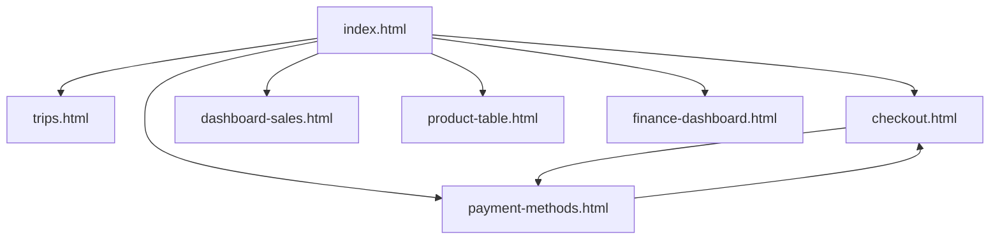

# Project Audit

## Overview

This repository is a small static prototype gallery built from standalone HTML files.
It is not a full application with a shared runtime, build pipeline, or backend.

The repo currently acts as a collection of UI experiments and flow demos that are served directly as static assets.

Evidence:
- Static asset deployment config via `wrangler.jsonc`
- Flat file structure with standalone `.html` files
- No `package.json`, build config, or app framework entrypoint

## Deployment Model

The project is configured to serve the repository root as static assets through Cloudflare tooling.

Evidence:
- `wrangler.jsonc:2` sets the project name to `antigravity-test-html`
- `wrangler.jsonc:4` points assets to `directory: "."`

Implication:
- Every HTML file in the repo can be published directly without a build step.
- The repo is optimized for quick static preview and demo hosting.

## Repository Structure

Top-level files and folders:
- `index.html`
- `trips.html`
- `checkout.html`
- `payment-methods.html`
- `dashboard-sales.html`
- `product-table.html`
- `finance-dashboard.html`
- `masonry.html`
- `img/`
- `placeholder.svg`
- `wrangler.jsonc`

Observed characteristics:
- The repo uses a flat structure.
- Pages are grouped only by filename, not by feature directory.
- Shared assets are limited to local images under `img/` and `placeholder.svg`.

## Entry Point

`index.html` is the effective entry point and prototype launcher.

It links to:
- `trips.html`
- `checkout.html`
- `payment-methods.html`
- `dashboard-sales.html`
- `product-table.html`
- `finance-dashboard.html`

Evidence:
- `index.html:66`
- `index.html:87`
- `index.html:99`
- `index.html:114`
- `index.html:126`
- `index.html:138`

Notable gap:
- `masonry.html` exists in the repo but is not linked from `index.html`.

## Page Inventory

### 1. `trips.html`

Purpose:
- Mobile-first travel marketplace prototype branded as `Tripkini`.

Primary content blocks:
- Hero banner carousel
- Search bar overlay
- Horizontal category icon menu
- Trending trips section
- Duration trip section
- Travel schedule section
- Popular destinations
- Visitor reviews carousel
- Recommendation grid
- Footer information and bottom navigation

Interactive behavior:
- Scroll progress indicator for icon menu (`trips.html:279`)
- Scroll progress indicator for duration menu (`trips.html:301`)
- Banner autoplay carousel with clone-slide looping (`trips.html:323`)
- Review carousel autoplay with cloned items (`trips.html:634`)

Assessment:
- Strongest B2C/travel discovery page in the repo
- Rich visual content and motion
- Still mostly content-driven and not tied to real data

### 2. `checkout.html`

Purpose:
- Mobile checkout flow prototype for travel booking.

Primary content blocks:
- Traveller details
- Trip item summary
- Quantity controls
- Simulated date selection
- Notes section
- Promo section
- Partial payment toggle
- Payment method list
- Transaction summary
- Sticky payment footer

Interactive behavior:
- Price and summary recalculation via `updateSummary()` (`checkout.html:317`)
- Quantity increment/decrement (`checkout.html:349`, `checkout.html:360`)
- Simulated date picker (`checkout.html:371`)
- Notes expand/collapse (`checkout.html:387`)
- Payment button validation and loading state (`checkout.html:398`)
- DP 30% toggle recalculation (`checkout.html:421`)

Assessment:
- Most complete transactional prototype in the repo
- Good example of stateful UI without a framework
- Still a front-end simulation only, with no persistence

### 3. `payment-methods.html`

Purpose:
- Mobile payment method selection page for the checkout flow.

Primary content blocks:
- Accordion-based payment categories
- Virtual account options
- Digital wallet options
- Fixed total bar and confirm button

Interactive behavior:
- Accordion toggle logic (`payment-methods.html:222`)

Navigation relationship:
- Linked from `checkout.html` (`checkout.html:160`)
- Links back to `checkout.html` through header and footer actions (`payment-methods.html:40`, `payment-methods.html:211`)

Assessment:
- Good visual continuation of checkout flow
- No real state handoff back to checkout

### 4. `dashboard-sales.html`

Purpose:
- Desktop admin sales dashboard branded as `Zendenta`.

Primary content blocks:
- Sidebar navigation
- KPI cards
- Search and toolbar header
- Tabbed bill/payment area
- Sales table with expanded bill details

Interactive behavior:
- No meaningful dynamic behavior detected
- Expanded bill detail appears hardcoded in the markup rather than toggled by JS

Assessment:
- Strong static admin dashboard mockup
- Better for visual review than interaction validation

### 5. `product-table.html`

Purpose:
- Desktop product management table prototype.

Primary content blocks:
- Header and team indicators
- Toolbar controls
- Statistics cards
- Product data table
- Floating bulk action bar

Interactive behavior:
- Row selection state (`product-table.html:543`)
- Select-all behavior (`product-table.html:603`)
- Indeterminate checkbox state (`product-table.html:599`)
- Floating action bar updates (`product-table.html:580`)
- Show/hide statistics section (`product-table.html:629`)
- Table view dropdown visual state (`product-table.html:659`)
- Filter visual state (`product-table.html:678`)
- Sort icon visual toggle (`product-table.html:694`)

Assessment:
- Strongest desktop interaction demo in the repo
- Semi-functional: interaction states exist, but data operations are visual only

### 6. `finance-dashboard.html`

Purpose:
- Dark-theme finance dashboard branded as `Findexa`.

Primary content blocks:
- Fixed sidebar
- Search/header controls
- Stats cards
- Wallet cards
- Overview chart
- Savings plan
- Recent transactions table

Interactive behavior:
- Lucide icon initialization (`finance-dashboard.html:993`)
- Chart.js overview chart render (`finance-dashboard.html:1006`)
- Placeholder wallet action button with alert (`finance-dashboard.html:1000`)

Assessment:
- Most custom-styled page in the repo
- Distinct from the Tailwind-based pages
- Visually polished but light on business interaction

### 7. `masonry.html`

Purpose:
- Marketplace-style masonry layout experiment.

Primary content blocks:
- Category grid
- Masonry recommendation feed

Interactive behavior:
- No meaningful JS logic detected

Assessment:
- A standalone layout demo
- Likely an experiment or early reference page
- Currently not surfaced from the main index

## Navigation Map

Primary navigation graph:

Observation:
- Only the checkout and payment pages form a real flow.
- The rest are parallel demos reachable from the index.

## Technology Stack in Practice

Observed implementation patterns:

### Tailwind CDN Pages
- `index.html`
- `trips.html`
- `checkout.html`
- `dashboard-sales.html`
- `product-table.html`

### Lucide-based Pages
- `checkout.html`
- `payment-methods.html`
- `finance-dashboard.html`

### Font Awesome Pages
- `index.html`
- `trips.html`
- `dashboard-sales.html`
- `product-table.html`

### Chart.js Usage
- Only `finance-dashboard.html` uses Chart.js (`finance-dashboard.html:14`, `finance-dashboard.html:1070`)

Implication:
- The repo mixes multiple visual and icon systems.
- This is acceptable for experimentation, but expensive to standardize later.

## Visual Language Consistency

The repo does not currently behave like a single product with one design system.

Distinct visual identities:
- `Tripkini`: mobile travel marketplace, bright and image-heavy
- `Checkout/Payment`: transactional mobile flow with clean utility styling
- `Zendenta`: white-blue SaaS admin dashboard
- `Findexa`: premium dark finance dashboard
- `Masonry`: orange marketplace experiment

Implication:
- The repo is better understood as a prototype collection than a unified app.

## External Dependencies

The project depends heavily on external CDNs and remote image services.

Observed sources:
- Tailwind CDN
- Font Awesome CDN
- Lucide CDN
- Chart.js CDN
- Google Fonts
- Wikimedia-hosted logos
- `placehold.co`
- `i.pravatar.cc`
- `flagcdn.com`
- `api.dicebear.com`

Implication:
- Fast to demo
- Fragile for offline or controlled deployment environments
- Branding and rendering can break if upstream assets change or fail

## Code Quality Assessment

### Strengths
- Small, readable pages
- Good naming inside inline scripts
- Fast iteration model
- No build complexity
- Several pages demonstrate realistic UI states

### Weaknesses
- No shared CSS or JS abstractions
- Heavy duplication across files
- State is local to each page only
- No test coverage
- No accessibility review evident from structure alone
- No content or asset fallback strategy

## Functional Maturity Ranking

From most interaction-rich to least:

1. `checkout.html`
2. `product-table.html`
3. `trips.html`
4. `payment-methods.html`
5. `finance-dashboard.html`
6. `dashboard-sales.html`
7. `masonry.html`

Rationale:
- `checkout.html` and `product-table.html` contain the clearest UI state logic.
- `trips.html` contains rich presentation behavior but little business state.
- `dashboard-sales.html` is mostly static despite visual complexity.

## Risks If This Repo Grows Without Refactor

### 1. Design Drift
Each page can continue evolving with different typography, icon systems, colors, and interaction rules.

### 2. Duplication Cost
Repeated patterns will become slower to maintain as more pages are added.

### 3. No Shared Data Model
Any attempt to connect pages into one app will require rethinking state management.

### 4. CDN Fragility
Production-grade reliability is weak if the repo keeps relying on third-party runtime assets.

### 5. Flat Structure Scalability
The current top-level file layout becomes harder to navigate as page count grows.

## Recommended Future Directions

### Option 1. Keep It as a Prototype Gallery
Best if the goal is demos and UI exploration.

Suggested actions:
- Link `masonry.html` from `index.html`
- Add a short description for each prototype
- Standardize naming and branding labels in the index

### Option 2. Focus It into a Travel Product Prototype
Best if the real product direction is travel booking.

Suggested focus files:
- `trips.html`
- `checkout.html`
- `payment-methods.html`

Suggested actions:
- Treat dashboards as separate experiments
- Build a consistent travel product flow

### Option 3. Turn It into a UI Reference Library
Best if the repo is intended as a source of design patterns.

Suggested actions:
- Group pages by domain
- Standardize dependencies
- Extract shared components or style tokens

## Final Assessment

This repository is best understood as a static HTML prototype collection with a few semi-functional interaction demos.

It is strong at:
- speed of iteration
- static deployment simplicity
- visual exploration

It is not yet strong at:
- scalability
- shared architecture
- cross-page state
- production maintainability

The most coherent product slice is the travel flow.
The most coherent desktop interaction slice is the product table demo.
The finance dashboard is the strongest custom visual system, but currently behaves as a polished standalone mockup rather than part of a shared product.
